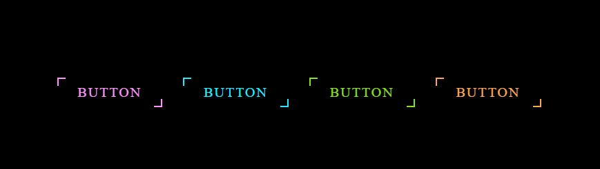
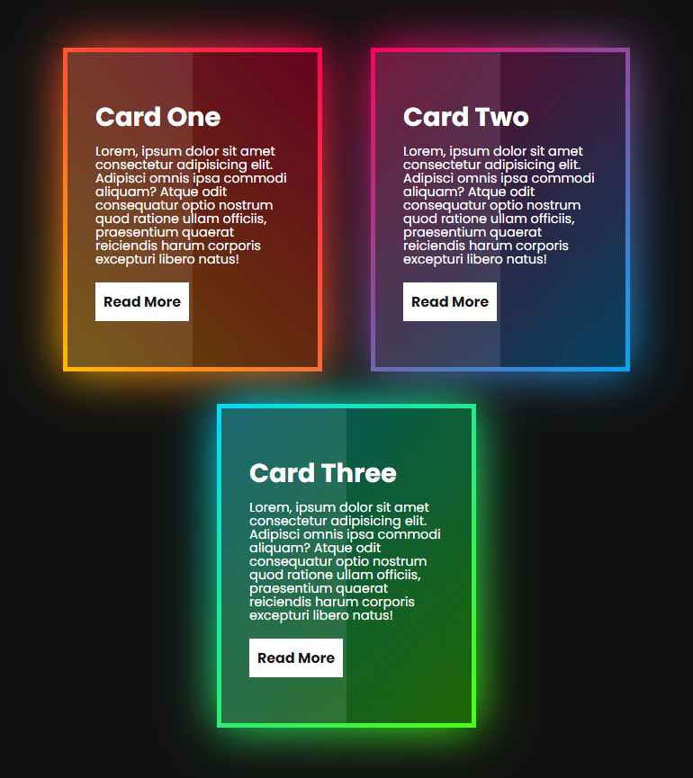
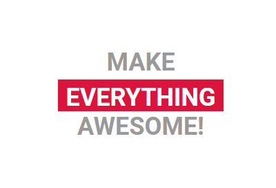
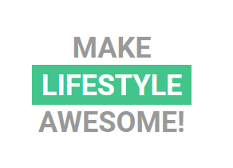
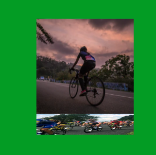
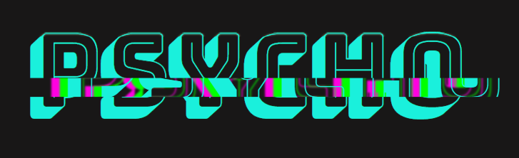

# css-workout

## Day-1-gradient border
#### gradient with border animation or translation

## Day-2-gradiendt-button
#### hover it to see the gradient magic and tranformation

## Day-2-gradient card
#### hover to translateY with gradient effect

## Day-4-loading-animation
#### a gradient loading page

## day-4-text-animat#ion-1
#### wait ti see text rolling came new word

## Day-5-3D-cube-animation
#### 3D cube effect 

## Day-6-text-animation-1
#### infinite time text animation

## Day-6-text-animation-2
#### hover the text to see the animation
Day-6-Text-glitch-2

